# Code Per Day

A GitHub Action that generates beautiful SVG charts showing your daily code additions/deletions and daily commit counts. Embed them in your profile README for a visual breakdown of your coding activity.

Uses the GitHub GraphQL API to fetch commit data across all repositories you've contributed to — including private repos when you provide a PAT with `repo` scope. **Only additions and deletions counts are exposed — no file names, repo names, or code content.**

## Preview

### Bar Charts

| Dark | Light |
|------|-------|
|  |  |

| Tokyo Night | Dracula |
|-------------|---------|
|  |  |

| Nord | Ocean |
|------|-------|
|  |  |

| Sunset | Forest |
|--------|--------|
|  |  |

| Midnight | Radical |
|----------|---------|
|  |  |

| GitHub Dark | Transparent |
|-------------|-------------|
|  |  |

### Area Charts

| Dark | Tokyo Night |
|------|-------------|
|  |  |

## Quick Start

### 1. Create a Personal Access Token

Go to [GitHub Settings > Developer settings > Personal access tokens > Fine-grained tokens](https://github.com/settings/tokens?type=beta) and create a token with:
- **Repository access**: All repositories (for private repo support) or just public
- **Permissions**: Contents (read-only), Metadata (read-only)

> For classic tokens, select the `repo` scope (or `public_repo` for public-only).

### 2. Add the secret

In your profile repository (`username/username`), go to **Settings > Secrets and variables > Actions** and add a new secret named `CPD_TOKEN` with your PAT.

### 3. Add the workflow

Create `.github/workflows/code-per-day.yml` in your profile repo:

```yaml
name: Code Per Day

on:
  schedule:
    - cron: "0 4 * * *"
  workflow_dispatch:

permissions:
  contents: write

jobs:
  generate:
    runs-on: ubuntu-latest
    steps:
      - uses: actions/checkout@v4

      - uses: mpge/code-per-day@v1
        with:
          github_token: ${{ secrets.CPD_TOKEN }}
          theme: dark
          period: "30"
          output_path: ./code-per-day
          image_types: "code,commits"
          all_themes: "false"

      - name: Commit
        run: |
          git config user.name github-actions
          git config user.email github-actions@github.com
          git add code-per-day/
          git diff --cached --quiet || (git commit -m "chore: update code-per-day" && git push)
```

### 4. Embed in your README

Add this to your profile `README.md`. The image links back to this repo so visitors can get their own:

```html
<p align="center">
  <a href="https://github.com/mpge/code-per-day" target="_blank">
    
  </a>
</p>

<p align="center">
  <a href="https://github.com/mpge/code-per-day" target="_blank">
    
  </a>
</p>
```

Or in plain Markdown (without the link wrapper):

```markdown


```

### 5. Run it

Trigger the workflow manually to generate your first chart:

1. Go to your profile repo on GitHub
2. Click **Actions** > **Code Per Day** > **Run workflow**
3. Wait for it to complete — your SVGs will be committed to the `code-per-day/` directory
4. Your README will now display the chart

After the first run, the workflow runs automatically every day at 4 AM UTC.

## Inputs

| Input | Default | Description |
|-------|---------|-------------|
| `github_token` | *required* | GitHub PAT. Use `repo` scope for private repos. |
| `username` | authenticated user | GitHub username to generate charts for |
| `theme` | `dark` | Theme name (see below) |
| `period` | `30` | Number of days to chart (30, 90, 365) |
| `output_path` | `./code-per-day` | Output directory for SVG files |
| `all_themes` | `false` | Generate an SVG for every built-in theme |
| `chart_type` | `bars` | Chart style: `bars` or `area` |
| `image_types` | `code` | Image families to generate: `code`, `commits`, or `all` |
| `animations` | `true` | Enable CSS entrance animations |

Generated filenames:

- `code-per-day-<theme>.svg` for additions/deletions charts
- `commits-per-day-<theme>.svg` for commit-count charts

## Themes

| Theme | Description |
|-------|-------------|
| `dark` | GitHub dark default |
| `light` | Clean light theme |
| `dracula` | Dracula color scheme |
| `tokyonight` | Tokyo Night palette |
| `nord` | Nord color palette |
| `ocean` | Deep blue ocean tones |
| `sunset` | Warm purple/orange gradients |
| `forest` | Green forest tones |
| `midnight` | Deep navy midnight |
| `radical` | Vibrant pink/yellow neon |
| `transparent` | Transparent background (works on any surface) |
| `github-dark` | GitHub's native dark theme colors |

Use `all_themes: "true"` to generate all themes at once, then pick the one you like.

## Privacy

This action only reads **commit additions and deletions counts** through the GitHub GraphQL API. It does **not** expose:
- Repository names or URLs
- File paths or names
- Code content or diffs
- Commit messages

The generated SVG contains only aggregated numerical data (total additions/deletions per day) and your username.

## Chart Types

### Bars (default)
Vertical bars — additions rise above the baseline, deletions fall below.

### Area
Smooth filled area chart with the same above/below layout.

## Image Types

### Code
The original additions/deletions chart. Supports both `bars` and `area`.

### Commits
A separate commit-count chart rendered as its own SVG. This ignores `chart_type` and always renders a single-series commit histogram.

## Limitations

Counts come from the GitHub API, which applies its own privacy filters. Expect gaps in these cases:

- **Private contributions are not always exposed.** GitHub's `contributionsCollection` field — the primary source of "which repos did you commit to" — silently drops contributions it classifies as restricted, even when the token has `repo` scope. When running against the token owner (no `username` override), this action backfills by enumerating every repo the token can read directly. When `username` is set to someone else, only repos GitHub exposes on their public profile are visible.
- **"Include private contributions on my profile"** must be enabled at https://github.com/settings/profile for private repo activity to surface at all on the authenticated user's own profile.
- **SAML SSO orgs require token authorization.** For a classic PAT, visit Settings → Personal access tokens → *your token* → **Configure SSO** and authorize every org whose private repos you want counted. Without this, contributions to those orgs land in `restrictedContributionsCount` and never reach this action.
- **Fine-grained PATs** are only partially supported. They work for public repos and personal private repos, but most orgs have not enabled fine-grained PAT access, and commit history in those org repos will be invisible. Use a classic PAT with `repo` scope for full coverage.
- **Org-enforced member privacy** cannot be worked around. If an org admin has restricted contribution visibility at the org level, neither the GraphQL API nor any token scope can expose those commits — the filter runs server-side.
- **External collaborator repos** only appear when the token has read access or when GitHub attributed your commit to the repo's public contribution graph. Repos you've never been granted access to will be missing.
- **Commits without linked GitHub identity.** If a commit was authored with an email that isn't verified on your GitHub account, matching falls back to noreply patterns and git author name; commits with no link to your login at all will be skipped.

## License

MIT
